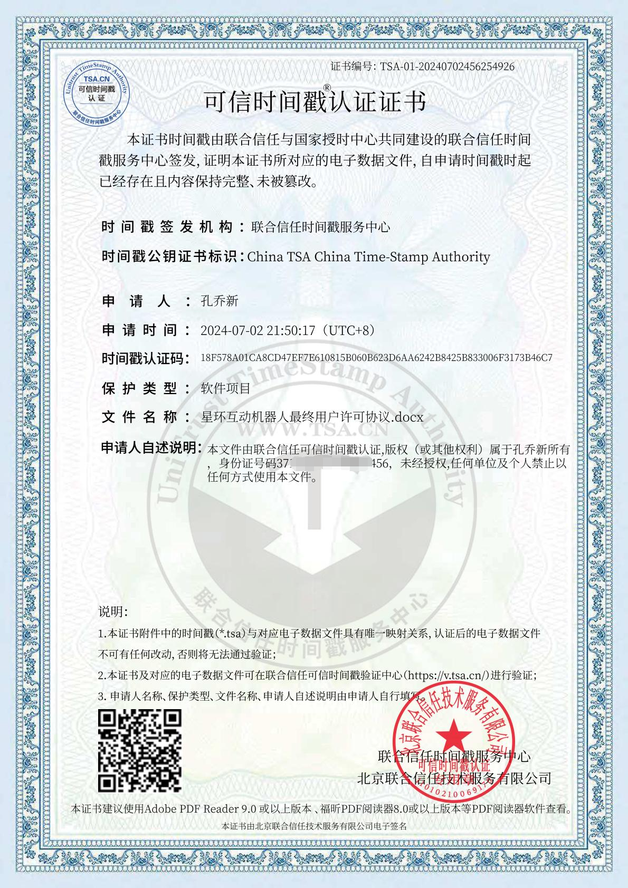

# 
最终用户许可协议

# 
EULA

欢迎您使用Firfly机器人，在使用前，请仔细阅读以下条款：

1. 本机器人仅限在微信群内使用，未经许可禁止私聊，加好友，拉群等

2. 星环互动团队倡导良好的使用环境，如有任何问题，请积极反馈，禁止辱骂机器人。

3. 本机器人部分源码对外开放，部分插件的代码不开源，未开源部分严禁进行任何形式的反编译、注入等操作。

4. 请勿外传签到功能

5. 为平衡运营成本，相关服务需付费使用，每个微信群每月收费为20元人民币。

6. 本协议构成双方间的全部协议，取代所有先前的书面或口头协议和理解。

7. 若本协议任何条款被认为无效或不可执行，其他条款仍然有效。

8. 出现违反本协议的情况，星环互动团队有权立即终止您的许可，终止许可后，机器人将不再对您提供任何服务。

9. 机器人所依赖主体源码的版权归TRSS所有，部分插件的版权归星环互动团队所有。

10. 初次使用本机器人时，会引导您查看本协议，使用本机器人的任意功能即代表您同意本协议，如有异议，请与我们联系

QQ: 3097872425 | 微信: REPAXL | 邮箱: 3097872425@qq.com | w3525118317@163.com

订立时间：2024年7月2日

订立时时间戳：1719927600

本协议已通过可信时间戳留档，禁止任何形式的盗用与篡改

